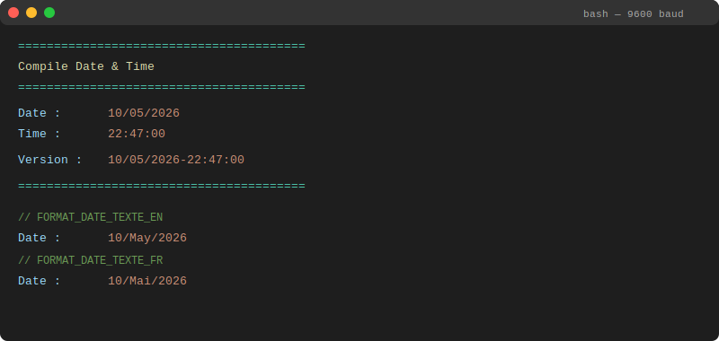
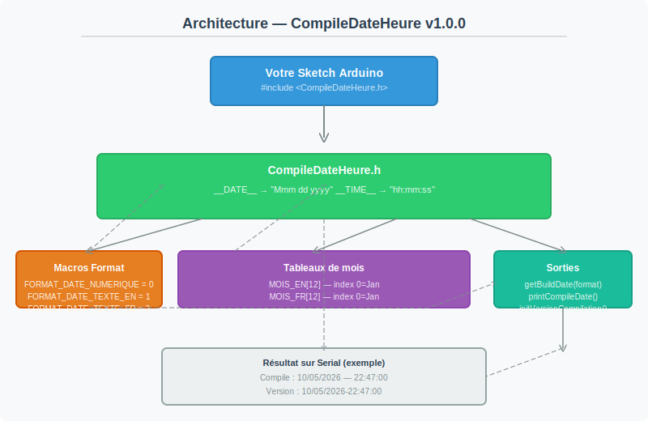

# CompileDateHeure

[](https://www.gnu.org/licenses/gpl-3.0)
[](https://docs.arduino.cc/software/ide/)
[](https://platformio.org/)
[](https://platformio.org/)
[](https://github.com/Fo170/CompileDateHeure)

**Auteur :** FOURNET Olivier — olivier.fournet@free.fr  
**Version :** 1.0.0  
**Licence :** GNU General Public License v3.0

---

Librairie Arduino permettant d'afficher la **date et l'heure de compilation** dans le moniteur série.  
Fonctionne sur **ESP8266**, **ESP32** et toute carte compatible Arduino IDE ou PlatformIO.

---

## Sommaire

1. [Installation](#installation)
2. [Utilisation rapide](#utilisation-rapide)
3. [Fonctions de l'API](#fonctions-de-lapi)
4. [Constantes de format](#constantes-de-format)
5. [Exemple complet](#exemple-complet)
6. [Architecture](#architecture)
7. [Compatibilité](#compatibilité)
8. [License](#license)

---

## Installation

### Arduino IDE

1. Téléchargez le dépôt ZIP : [Code → Download ZIP](https://github.com/Fo170/CompileDateHeure/archive/refs/heads/main.zip)
2. Dans l'IDE Arduino : **Croquis → Inclure une bibliothèque → Ajouter la bibliothèque .ZIP…**
3. Sélectionnez le fichier ZIP extrait

### PlatformIO

Ajoutez dans votre `platformio.ini` :

```ini
[env:esp32dev]
platform = espressif32
board = esp32dev
framework = arduino
lib_deps =
    https://github.com/Fo170/CompileDateHeure.git@^1.0.0
```

Ou dans un projet local, placez le dossier `CompileDateHeure/` dans `lib/`.

---

## Utilisation rapide

```cpp
#include <CompileDateHeure.h>

void setup() {
    Serial.begin(9600);
    printCompileDate();
}

void loop() {
}
```

---

## Fonctions de l'API

### `printCompileDate()`

Affiche la date, l'heure et la version de compilation sur le port série.

**Sortie exemple :**



### `getBuildDate(int format)`

Retourne un `String` contenant la date formatée.

| Paramètre `format` | Valeur | Résultat |
|---|---|---|
| `FORMAT_DATE_NUMERIQUE` | `0` | `"10/05/2026"` |
| `FORMAT_DATE_TEXTE_EN` | `1` | `"10/May/2026"` |
| `FORMAT_DATE_TEXTE_FR` | `2` | `"10/Mai/2026"` |

### `initVersionCompilation(int format)`

Initialise la variable globale `s_versionCompilation` avec la date et l'heure au format `"dd/mm/yyyy-hh:mm:ss"`.

```cpp
initVersionCompilation(FORMAT_DATE_NUMERIQUE);
Serial.println(s_versionCompilation);
// → 10/05/2026-22:47:00
```

---

## Constantes de format

| Constante | Valeur | Description |
|---|---|---|
| `FORMAT_DATE_NUMERIQUE` | `0` | Numérique : `dd/mm/yyyy` |
| `FORMAT_DATE_TEXTE_EN` | `1` | Anglais : `dd/Mmm/yyyy` |
| `FORMAT_DATE_TEXTE_FR` | `2` | Français : `dd/Mmm_fr/yyyy` |

---

## Exemple complet

```cpp
#include <CompileDateHeure.h>

void setup() {
    Serial.begin(9600);
    delay(1000);

    // Affichage simple
    printCompileDate();

    // Format texte anglais
    Serial.print("EN : ");
    Serial.println(getBuildDate(FORMAT_DATE_TEXTE_EN));

    // Format texte français
    Serial.print("FR : ");
    Serial.println(getBuildDate(FORMAT_DATE_TEXTE_FR));

    // Variable de version
    initVersionCompilation(FORMAT_DATE_NUMERIQUE);
    Serial.print("Version : ");
    Serial.println(s_versionCompilation);
}

void loop() {
}
```

---

## Architecture



Le schéma ci-dessus montre le flux :

1. Le **preprocesseur C/C++** injecte automatiquement `__DATE__` et `__TIME__` à la compilation
2. `CompileDateHeure.h` convertit ces macros en chaînes formatées via `getBuildDate()`
3. `printCompileDate()` et `s_versionCompilation` utilisent ces valeurs pour l'affichage

---

## Compatibilité

| Plateforme | Support | Notes |
|---|---|---|
| ESP32 | ✅ | Via PlatformIO ou Arduino IDE |
| ESP8266 | ✅ | Via PlatformIO ou Arduino IDE |
| AVR (Arduino Uno, etc.) | ✅ | Toute carte avec Arduino framework |
| Clang/GCC | ✅ | Utilise les macros standard `__DATE__` / `__TIME__` |

**Dépendances :** `Arduino.h` uniquement (inclus automatiquement par l'IDE).

---

## License

Ce projet est distribué sous licence **GNU General Public License v3.0**.  
Voir le fichier [LICENSE](LICENSE) pour les détails complets.

---

*Dernière mise à jour : 2026-05-10*